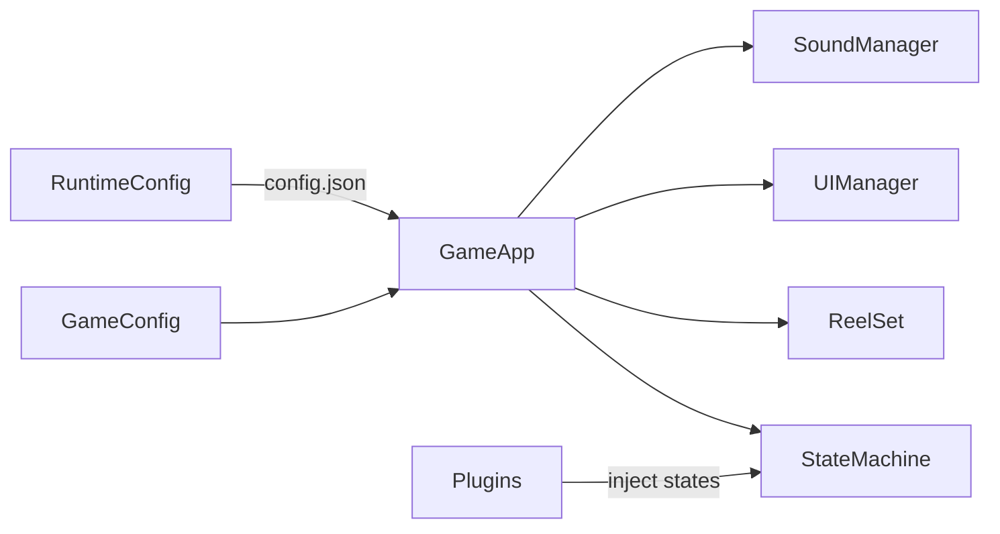

# LAB9191 Slot SDK

Production-ready slot game framework built on **PixiJS v8**, **TypeScript**, and **Vite**.

Designed for building casino slot games with production-grade quality and feature set.

## Quick Start

```bash
pnpm install
pnpm build:core
cd games/book-of-gold && pnpm dev
```

Open [http://localhost:3000](http://localhost:3000) to see the "4 Pots of Luck" demo game.

## Architecture

```
slot-sdk/
  packages/core/     @lab9191/slot-core — the SDK library
  games/             Individual game implementations
  docs/              Full documentation
  tests/             E2E tests (Playwright)
```

The SDK is a **plugin-based framework**. Each game mechanic (Free Spins, Hold & Win, Cascade, etc.) is a self-contained plugin that injects its states into the game's finite state machine.



## Key Features

| Feature | Description |
|---------|-------------|
| **Reel Engine** | Configurable grid (3x3 to 6x4+), smooth spring-bounce animations |
| **State Machine** | FSM with plugin-injected states and transitions |
| **Plugin System** | Free Spins, Hold & Win, Cascade, Collect, Buy Bonus, Ante Bet, Gift Spins |
| **Responsive** | Landscape + Portrait with separate design dimensions and auto-layout |
| **Safe Area** | CSS `env(safe-area-inset-*)` + config-based safe zones |
| **UI System** | Bottom bar, side spin button, bet selector, auto play, settings, info menu |
| **Win Presentation** | Win lines with payouts, GSAP-powered Big Win celebration with coin fountain |
| **Preloader** | Branded splash screen with animated letter reveal and progress bar |
| **Telemetry** | Auto-logs every event transparently for crash reports and debugging |
| **Round Replay** | Record rounds, share by URL, deterministic replay via event sourcing |
| **Runtime Config** | External `config.json` for operator-level configuration |
| **Sound** | Howler.js integration with mute, volume, music support |
| **Server Adapter** | Interface pattern — swap between mock and real backend |
| **Keyboard** | Space to spin/stop, hold for turbo |
| **Skip Animations** | Click/tap/space to skip win presentation |

## Creating a New Game

1. Create a folder in `games/`
2. Define symbols, paytable, paylines in `GameDefinition.ts`
3. Create `config.json` with runtime settings (bet levels, big win thresholds, etc.)
4. Implement `IServerAdapter` for your backend (or use `MockServerAdapter`)
5. In `main.ts`: load config, boot `GameApp`, add decorative elements, hide preloader

See [docs/getting-started.md](docs/getting-started.md) for a full walkthrough.

## Documentation

- [Architecture Overview](docs/architecture.md)
- [Getting Started](docs/getting-started.md)
- [Game Config Reference](docs/game-config.md)
- [Plugin System](docs/plugins.md)
- [State Machine](docs/state-machine.md)
- [UI System](docs/ui-system.md)
- [Runtime Config](docs/runtime-config.md)
- [Telemetry & Debugging](docs/telemetry.md)
- [Round Replay](docs/replay.md)
- [Responsive Layout](docs/responsive.md)

## Tech Stack

- **PixiJS v8** — rendering
- **TypeScript** — type safety
- **Vite** — bundling
- **GSAP** — Big Win animations
- **Howler.js** — audio
- **Playwright** — E2E testing
- **pnpm workspaces** — monorepo

## License

Proprietary. Copyright LAB9191 Games.
