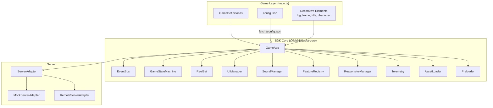
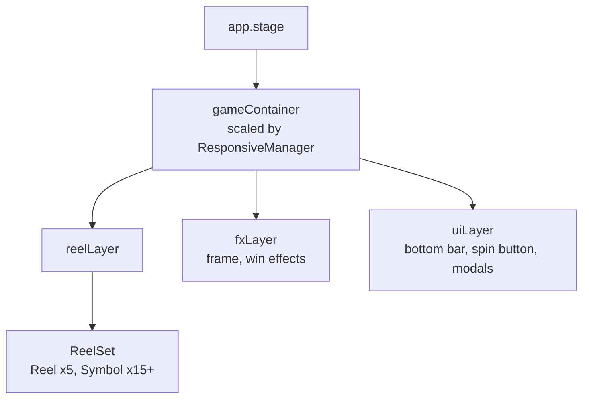
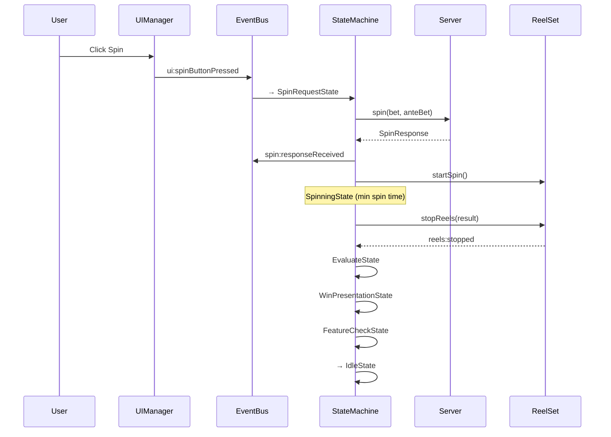

# Architecture Overview

## High-Level Architecture

## Layer Hierarchy

PixiJS display objects are organized in layers:

**Z-order (back to front):**
1. Background sprite (added to `gameContainer` at index 0)
2. Reel background (dark overlay in `reelLayer`)
3. ReelSet with symbols (`reelLayer`)
4. Reel frame (`fxLayer` — renders OVER symbols)
5. Win lines, coin effects (`fxLayer`)
6. Bottom bar, spin button, modals (`uiLayer`)
7. Decorative elements — title, character (`gameContainer`)

## Module Responsibilities

| Module | Responsibility |
|--------|---------------|
| **GameApp** | Bootstrap, lifecycle, layer management, layout target |
| **EventBus** | Typed pub/sub for all module communication |
| **GameStateMachine** | FSM controlling game flow (idle → spin → evaluate → win → feature) |
| **ReelSet / Reel / Symbol** | Visual reel engine with animation strategies |
| **UIManager** | All UI components — bottom bar, spin button, menus |
| **SoundManager** | Audio playback via Howler.js |
| **FeatureRegistry** | Plugin installation and FSM state injection |
| **ResponsiveManager** | Resize handling, landscape/portrait switching |
| **Telemetry** | Transparent event logging for debugging |
| **AssetLoader** | PixiJS Assets API wrapper with progress callbacks |
| **Preloader** | HTML-based branded splash screen |

## Data Flow

## Key Design Decisions

1. **Server is the single source of truth** — client never computes RNG or payouts
2. **Plugin architecture** — game mechanics are plugins, not hard-coded
3. **Composition over inheritance** — games configure via objects, not subclassing
4. **Event-driven** — all modules communicate through EventBus
5. **External runtime config** — operator can tune game via config.json without rebuilding
6. **HTML preloader** — doesn't touch PixiJS render pipeline
7. **Telemetry by default** — every event logged transparently
