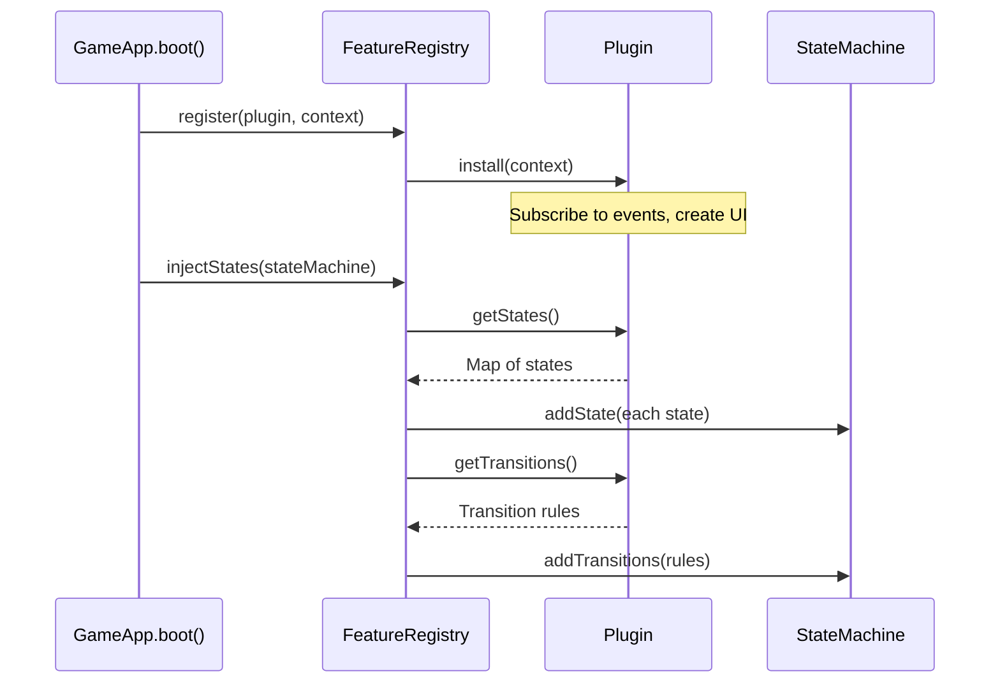

# Plugin System

Every game mechanic is a self-contained plugin implementing `IFeaturePlugin`. Plugins inject their own states and transitions into the FSM without modifying the core engine.

## Plugin Interface

```typescript
interface IFeaturePlugin {
  readonly id: string;        // unique identifier
  readonly name: string;      // display name
  readonly priority: number;  // lower = earlier registration

  install(context: FeatureContext): void;
  uninstall(): void;
  getStates?(): Map<string, IState>;
  getTransitions?(): StateTransition[];
}
```

## Plugin Lifecycle



## Built-in Plugins

### FreeSpinsFeature
- **Trigger:** N scatter symbols on reels
- **States:** `freeSpins:intro` → `freeSpins:spin` → `freeSpins:eval` → `freeSpins:summary`
- **Config:** `triggerSymbolId`, `triggerCount`, `spinsAwarded`, `retriggerable`

### HoldAndWinFeature
- **Trigger:** 6+ bonus symbols
- **States:** `holdAndWin:intro` → `holdAndWin:respin` → `holdAndWin:eval` → `holdAndWin:summary`
- **Config:** `initialRespins`, `cols`, `rows`, `jackpots[]`

### CascadeFeature
- **Trigger:** Server returns `cascadeChain`
- **States:** `cascade:process`
- **Config:** `multiplierProgression`, `removeAnimDuration`, `dropAnimDuration`

### CollectFeature
- **Trigger:** Collect-type wins in response
- **States:** `collect:process`
- **Config:** `collectSymbolId`, `collectableSymbolIds`

### BuyBonusFeature
- **Trigger:** UI button
- **States:** `buyBonus:process`
- **Config:** via `GameConfig.buyBonusOptions[]`

### AnteBetFeature
- **Trigger:** UI toggle
- **States:** none (modifies bet calculation)
- **Config:** `multiplier`, `description`

### GiftSpinsFeature
- **Trigger:** Server sends `giftSpins` in InitResponse
- **States:** `giftSpins:active` → `giftSpins:summary`
- **Config:** none (data from server)

## Creating a Custom Plugin

```typescript
import type { IFeaturePlugin, FeatureContext } from '@lab9191/slot-core';

export class MyCustomFeature implements IFeaturePlugin {
  readonly id = 'myCustom';
  readonly name = 'My Custom Mechanic';
  readonly priority = 40;

  install(context: FeatureContext): void {
    // Subscribe to events, create UI elements
    context.eventBus.on('reels:stopped', (data) => {
      // React to reels stopping
    });
  }

  uninstall(): void {
    // Cleanup
  }

  getStates(): Map<string, IState> {
    const states = new Map<string, IState>();
    states.set('myCustom:intro', new MyIntroState());
    states.set('myCustom:play', new MyPlayState());
    states.set('myCustom:summary', new MySummaryState());
    return states;
  }

  getTransitions(): StateTransition[] {
    return []; // FeatureCheckState auto-routes to {type}:intro
  }
}
```

Register in GameConfig:
```typescript
features: [
  new FreeSpinsFeature({ ... }),
  new MyCustomFeature(),
]
```
