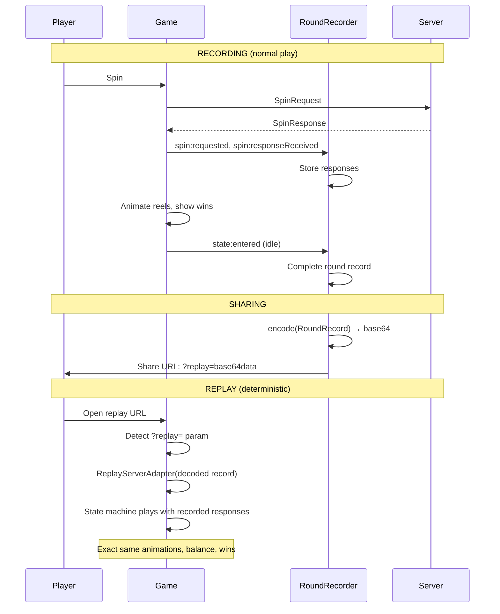
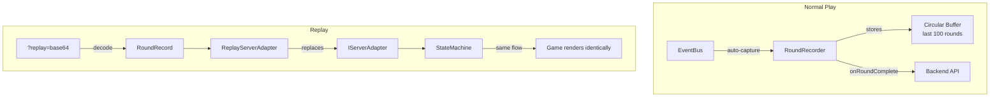

# Round Replay System

Deterministic round replay via event sourcing — records server responses and replays them through the same state machine.

## How It Works



## What Gets Recorded

Each `RoundRecord` contains:

| Field | Description |
|-------|-------------|
| `roundId` | Unique ID (timestamp + random) |
| `timestamp` | ISO datetime of round start |
| `gameId`, `gameVersion` | For audit trail |
| `player.balanceBefore` | Balance when round started |
| `player.balanceAfter` | Balance after round completed |
| `player.bet`, `currency` | Bet amount and currency |
| `player.anteBetEnabled` | Ante bet state |
| `activeContext` | Active features, tournament, promotions |
| `spinRequest` | The original SpinRequest sent to server |
| `spinResponse` | Main spin server response |
| `featureResponses[]` | All feature round responses (free spins, hold&win) |
| `outcome.totalWin` | Total win across all rounds |
| `outcome.featureTriggered` | Feature type if triggered |
| `outcome.bigWinTier` | "big" / "mega" / "epic" or null |
| `outcome.jackpotWon` | Jackpot type or null |
| `outcome.durationMs` | Round duration in milliseconds |

Typical round record size: **2-10 KB** (JSON).

## Recording (Automatic)

Recording is fully automatic — `RoundRecorder` attaches to `EventBus` and captures every round without developer intervention.

```typescript
// Already initialized in GameApp.boot() — no setup needed
// Access the recorder:
game.roundRecorder.getRecentRounds(10);  // last 10 rounds
game.roundRecorder.getRound('abc123');    // specific round

// Listen for completed rounds:
game.roundRecorder.onRoundComplete = (record) => {
  // Send to backend, analytics, etc.
  fetch('/api/rounds', {
    method: 'POST',
    body: JSON.stringify(record),
  });
};
```

## Sharing a Replay

```typescript
import { RoundRecorder } from '@lab9191/slot-core';

// Get the last completed round
const rounds = game.roundRecorder.getRecentRounds(1);
const record = rounds[0];

// Generate shareable URL
const url = RoundRecorder.createReplayUrl(record, 'https://game.example.com');
// → https://game.example.com?replay=eyJ2ZXJzaW9uIj...

// Or encode/decode manually
const encoded = RoundRecorder.encode(record);
const decoded = RoundRecorder.decode(encoded);
```

## Replay Mode

When a user opens a URL with `?replay=...`, the game automatically:

1. Decodes the `RoundRecord` from the URL
2. Replaces the real `IServerAdapter` with `ReplayServerAdapter`
3. `ReplayServerAdapter.init()` returns the recorded balance and bet
4. `ReplayServerAdapter.spin()` returns recorded responses in order
5. State machine plays through the exact same sequence
6. Same animations, same win presentation, same feature rounds

```typescript
// GameApp.boot() handles this automatically:
const replayRecord = RoundRecorder.getReplayFromUrl();
if (replayRecord) {
  this.replayMode = true;
  this.config.server = new ReplayServerAdapter(replayRecord);
}

// Check in main.ts if needed:
if (game.replayMode) {
  // Hide bet controls, show "REPLAY" badge, etc.
}
```

## Regulatory Compliance

This system satisfies GLI/BMM audit requirements:

- **Deterministic reconstruction** — same inputs produce same outputs
- **Complete audit trail** — every round recorded with timestamps
- **Balance tracking** — before/after balance for every round
- **Feature state** — captures active promotions, tournaments
- **Config hash** — can verify game config at time of play
- **No client-side RNG** — all results from server responses

## Architecture


