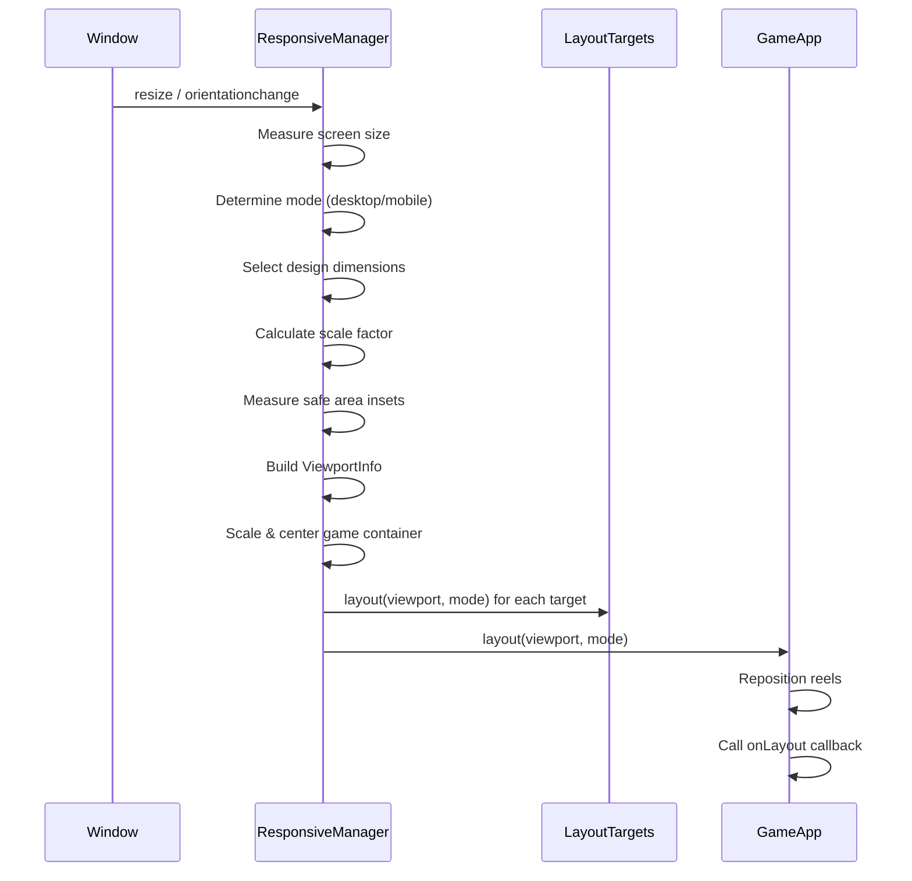

# Responsive Layout System

The SDK automatically adapts to any screen size and orientation. The `ResponsiveManager` handles scaling, orientation detection, safe area measurement, and notifies all registered components when the layout changes.

## Layout Modes

The SDK uses two layout modes determined by the screen aspect ratio:

| Mode | Condition | Typical Use |
|---|---|---|
| `desktop` | Screen width >= height (landscape) | Desktop browsers, landscape tablets |
| `mobile` | Screen height > width (portrait) | Phones, portrait tablets |

```ts
export type LayoutMode = 'desktop' | 'mobile';
```

Detection is automatic -- when `screenHeight > screenWidth`, the mode switches to `mobile`.

## Design Dimensions

Each mode uses different design dimensions. The game is authored at a fixed logical resolution, and the SDK scales it uniformly to fit the actual screen.

| Orientation | Default Design Size | Configured In |
|---|---|---|
| Landscape | 1920 x 1080 | `layout.designWidth` / `layout.designHeight` |
| Portrait | 1080 x 1920 | `layout.portrait.designWidth` / `layout.portrait.designHeight` |

If portrait dimensions are not explicitly set, the SDK swaps the landscape dimensions automatically (1080 x 1920).

```ts
layout: {
  designWidth: 1920,
  designHeight: 1080,
  orientation: 'both',
  reelArea: { x: 480, y: 165, width: 1000, height: 590 },
  portrait: {
    designWidth: 1080,
    designHeight: 1920,
    reelArea: { x: 25, y: 240, width: 1030, height: 700 },
  },
}
```

## Scaling

The game container is scaled uniformly using `Math.min(screenWidth / designWidth, screenHeight / designHeight)` and centered within the screen. This ensures the full design area is always visible (letterboxed if needed).

```mermaid
graph LR
    subgraph Screen["Actual Screen"]
        subgraph Canvas["Scaled Game Canvas"]
            Content["Design Space<br/>(1920x1080 or 1080x1920)"]
        end
    end

    style Screen fill:#333
    style Canvas fill:#0a0a14
```



## ResponsiveManager

The `ResponsiveManager` class is created during `GameApp.boot()`. It listens for `resize` and `orientationchange` events and recalculates the viewport on every change.

### Lifecycle



### LayoutTarget Interface

Any component that needs to respond to layout changes implements `LayoutTarget`:

```ts
export interface LayoutTarget {
  layout(viewport: ViewportInfo, mode: LayoutMode): void;
}
```

Register targets with `responsiveManager.register(target)`. The SDK automatically registers `GameApp` and `UIManager`.

### ViewportInfo

The `ViewportInfo` structure is passed to every layout callback:

```ts
export interface ViewportInfo {
  width: number;           // Actual screen width in CSS pixels
  height: number;          // Actual screen height in CSS pixels
  scale: number;           // Scale factor applied to game container
  mode: LayoutMode;        // 'desktop' or 'mobile'
  designWidth: number;     // Active design width (changes per orientation)
  designHeight: number;    // Active design height
  reelArea: {              // Reel area rect for current orientation
    x: number;
    y: number;
    width: number;
    height: number;
  };
  safeInsets: SafeAreaInsets;  // Device safe area insets in screen pixels
  safeArea: {                  // Computed safe area in design coordinates
    x: number;
    y: number;
    width: number;
    height: number;
  };
}
```

## Safe Area System

The SDK automatically detects device safe area insets (e.g. iPhone notch, Android cutouts) using CSS `env(safe-area-inset-*)` values.

### How Detection Works

1. A hidden probe `<div>` is injected into the page with CSS padding set to `env(safe-area-inset-*)`.
2. On each resize, `getComputedStyle` reads the actual padding values.
3. These insets (in screen pixels) are converted to design coordinates by dividing by the scale factor.
4. The config-defined `safeArea` is merged with the device insets -- the final safe area is the **intersection** (most restrictive) of both.

```ts
// Config safe area: { x: 40, y: 10, width: 1840, height: 1060 }
// Device insets: { top: 47, right: 0, bottom: 34, left: 0 }  (iPhone)
// Result: safe area is shrunk from the top/bottom by the device insets
```

### SafeAreaInsets

```ts
export interface SafeAreaInsets {
  top: number;     // Screen pixels
  right: number;
  bottom: number;
  left: number;
}
```

### Impact on UI

- `BottomBar` receives safe margins via `setSafeMargins(left, right)` and offsets interactive elements inward
- `UIManager` positions the bottom bar within the safe area
- The side spin button is clamped to `safe.x + safe.width - 70` to prevent clipping
- Decorative elements (background, frame) can extend beyond the safe area

## How Components Respond to Layout

### GameApp

Implements `LayoutTarget`. On layout change:

1. Repositions the reel grid to the current orientation's `reelArea`
2. Scales the reel set if the reel area is smaller/larger than the natural symbol size
3. Calls the game-level `onLayout` callback for decorative elements

### UIManager

Implements `LayoutTarget`. On layout change:

1. Repositions the bottom bar to the bottom of the safe area
2. Switches the bottom bar between desktop and mobile layouts
3. Sets safe margins on the bottom bar
4. In desktop mode: shows the side spin button to the right of reels, hides the bar spin button
5. In mobile mode: moves the spin button to center below reels at 1.3x scale

### BottomBar

Receives `layoutMode(mode, width, height)` calls:

- **Desktop**: full-width layout with balance left, bet center-left, win right, spin button far right
- **Mobile**: compact 3-column layout, elements spaced evenly across the safe width

### Auto Portrait Reel Area

If `layout.portrait.reelArea` is not specified, the SDK auto-calculates it:

- Width: 90% of portrait design width
- Height: derived from landscape reel aspect ratio
- X: centered horizontally
- Y: 12% down from top (leaving room for title)

## onLayout Callback

Games register a layout callback on `GameApp` to reposition decorative elements (background, frame, character sprites) on orientation changes:

```ts
const doLayout = (viewport: ViewportInfo, mode: LayoutMode) => {
  const dw = viewport.designWidth;
  const dh = viewport.designHeight;
  const ra = viewport.reelArea;

  // Background: cover design area
  if (bg) {
    const bgAspect = bg.texture.width / bg.texture.height;
    const designAspect = dw / dh;
    if (designAspect > bgAspect) {
      bg.width = dw;
      bg.height = dw / bgAspect;
    } else {
      bg.height = dh;
      bg.width = dh * bgAspect;
    }
    bg.x = (dw - bg.width) / 2;
    bg.y = (dh - bg.height) / 2;
  }

  // Frame: surround reel area
  if (frame) {
    const pad = 35;
    frame.x = ra.x - pad;
    frame.y = ra.y - pad;
    frame.width = ra.width + pad * 2;
    frame.height = ra.height + pad * 2;
  }

  // Character: show only in desktop
  if (character) {
    character.visible = (mode === 'desktop');
    if (mode === 'desktop') {
      character.x = ra.x - 115;
      character.y = ra.y + ra.height + 40;
    }
  }
};

game.onLayout = doLayout;
// Call immediately for initial layout
doLayout(game.responsiveManager.viewport, game.responsiveManager.mode);
```

The callback is invoked on every resize, orientationchange, and when first registered.

## Layout Diagrams

### Landscape (Desktop)

```mermaid
graph TB
    subgraph Design["Design Space (1920 x 1080)"]
        direction TB
        subgraph SafeArea["Safe Area (40,10 -> 1880,1070)"]
            direction LR
            Title["Title"]
            Character["Character"]
            ReelFrame["Reel Frame + Grid<br/>(480,165 -> 1480,755)"]
            SpinBtn["Spin<br/>Button"]
        end
        subgraph BarArea["Bottom Bar (0,1010 -> 1920,1080)"]
            BarContent["[Menu] Balance | Bet | Win [Auto]"]
        end
    end

    style Design fill:#0a0a14
    style SafeArea fill:none,stroke:#444,stroke-dasharray:5
    style BarArea fill:#0d0d1a
```



```
+------------------------------------------------------------------+
| Safe Area                                                         |
|                                                                   |
|                    [  GAME TITLE  ]                               |
|                                                                   |
|  [Char]   +--------REEL AREA--------+      ( Spin )              |
|  [acter]  |  480,165          1480   |      (Button)              |
|           |                          |                            |
|           |    5 x 3 Symbol Grid     |                            |
|           |                          |                            |
|           +-------------------755----+                            |
|                                                                   |
+------------------------------------------------------------------+
| Bottom Bar                                                    1080|
+------------------------------------------------------------------+
  0                                                             1920
```

### Portrait (Mobile)

```mermaid
graph TB
    subgraph Design["Design Space (1080 x 1920)"]
        direction TB
        subgraph SafeArea2["Safe Area (20,50 -> 1060,1870)"]
            Title2["Title (scaled 50%)"]
            ReelFrame2["Reel Frame + Grid<br/>(25,240 -> 1055,940)"]
            SpinArea["Spin Button<br/>(centered, 1.3x scale)"]
        end
        subgraph BarArea2["Bottom Bar"]
            BarContent2["[Menu] Bal | Bet | Win [Auto]"]
        end
    end

    style Design fill:#0a0a14
    style SafeArea2 fill:none,stroke:#444,stroke-dasharray:5
    style BarArea2 fill:#0d0d1a
```



```
+------------------------------+
| Safe Area                     |
|                               |
|      [  GAME TITLE  ]        |
|                               |
| +---REEL AREA (25,240)-----+ |
| |                           | |
| |   5 x 3 Symbol Grid      | |
| |                           | |
| +----------------(1055,940)-+ |
|                               |
|         (  Spin  )            |
|         ( Button )            |
|                               |
|                               |
|   (more space for features)   |
|                               |
+-------------------------------+
| Bottom Bar (compact)          |
+-------------------------------+
  0                          1080
```

### Scale Calculation

The scale factor ensures the game fits within the screen:

```
scale = min(screenWidth / designWidth, screenHeight / designHeight)
```

The game container is then centered:

```
container.x = (screenWidth - designWidth * scale) / 2
container.y = (screenHeight - designHeight * scale) / 2
```

This produces letterboxing (black bars) when the screen aspect ratio differs from the design ratio, ensuring all content is always visible.
