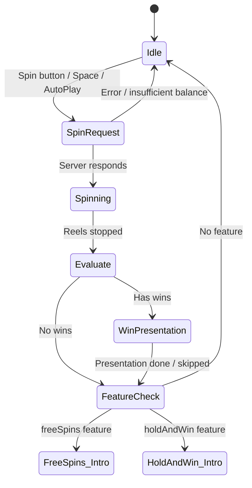
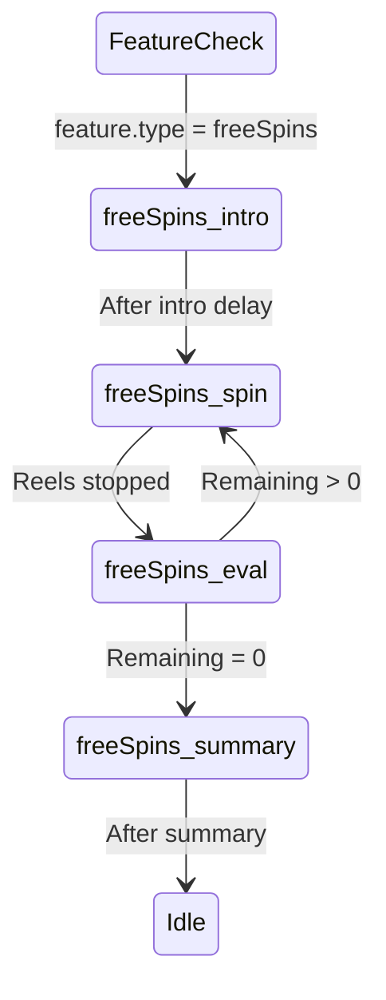
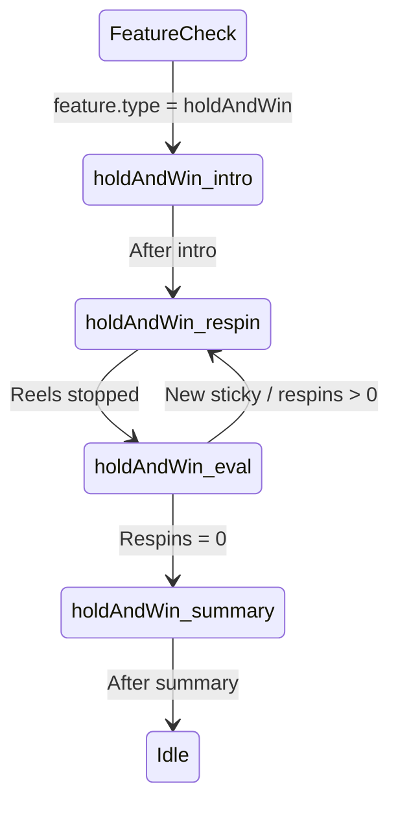

# State Machine

The game flow is driven by a finite state machine (FSM). The core SDK provides default states; feature plugins inject additional states and transitions.

## Core States



## State Descriptions

### IdleState
- Enables UI interaction (bet selector, menu, autoplay)
- Listens for `ui:spinButtonPressed` and `ui:autoPlayStarted`
- Checks auto play continuation and stop conditions
- Resets win display

### SpinRequestState
- Locks UI controls
- Validates balance >= bet amount
- Sends `SpinRequest` to server via `IServerAdapter.spin()`
- Stores `SpinResponse` in `context.lastResponse`
- Updates balance from server response

### SpinningState
- Starts reel spin animation
- Waits minimum spin time (600ms normal, 300ms quick spin)
- Listens for stop button → quick stop
- Calls `reelSet.stopReels(result)` with server's reel result

### EvaluateState
- Checks `lastResponse.wins` and `totalWin`
- Routes to `WinPresentation` if wins exist, otherwise `FeatureCheck`

### WinPresentationState
- Shows Big Win celebration (GSAP + coin fountain) if threshold met
- Presents individual win lines with payout amounts
- Dims non-winning symbols
- Skip via click/tap/Space/Enter
- Count-up animation for total win

### FeatureCheckState
- Checks `lastResponse.feature` for triggered bonus
- Transitions to plugin-provided state (e.g. `freeSpins:intro`)
- Falls back to `Idle` if no feature

## Free Spins Sub-States



## Hold & Win Sub-States



## Adding Custom States via Plugins

Plugins implement `IFeaturePlugin.getStates()` and `getTransitions()`:

```typescript
getStates(): Map<string, IState> {
  const states = new Map<string, IState>();
  states.set('myFeature:intro', new MyIntroState());
  states.set('myFeature:play', new MyPlayState());
  states.set('myFeature:summary', new MySummaryState());
  return states;
}
```

The `FeatureCheckState` automatically transitions to `{featureType}:intro` when a feature is triggered. The plugin's summary state should transition back to `idle`.
