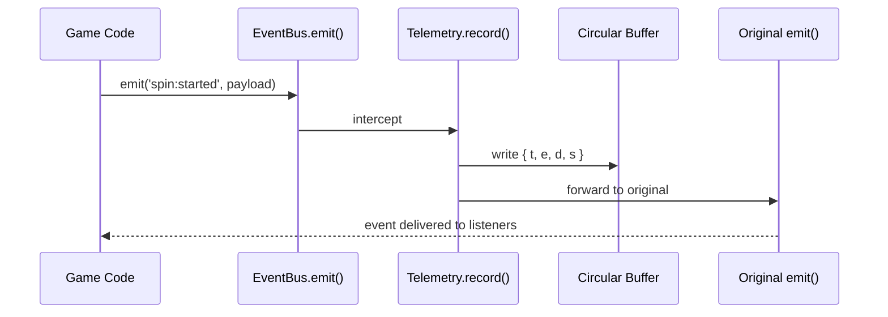

# Telemetry & Debugging

The SDK includes a transparent telemetry system that automatically records every event flowing through the `EventBus`. It requires zero configuration from game developers and provides powerful debugging tools for crash reports and post-mortem analysis.

## How It Works

When `GameApp` boots, it creates a `Telemetry` instance that **monkey-patches `EventBus.emit()`**. Every event emitted through the bus is transparently intercepted, timestamped, and stored in a circular buffer before being forwarded to the original handler. Game code does not need to do anything -- telemetry is always active.



## Circular Buffer

Events are stored in a fixed-size circular buffer (default 2000 entries). When the buffer is full, the oldest events are overwritten. This ensures bounded memory usage regardless of session length.

Each entry has the structure:

```ts
interface TelemetryEvent {
  t: number;          // Monotonic timestamp (ms since session start)
  e: string;          // Event name (e.g. 'spin:started', 'win:countUp')
  d: unknown;         // Serialized payload (or undefined if includePayloads=false)
  s: string | null;   // Current FSM state at time of event (e.g. 'idle', 'spinning')
}
```

### Payload Safety

Payloads are safely serialized with protection against:
- **Circular references**: caught by `JSON.stringify`, falls back to type + toString
- **Large payloads**: truncated to 2048 characters, replaced with `{ __truncated: true, keys: [...] }`
- **Non-serializable objects**: replaced with `{ __type, __toString }`

## Auto-Capture of Errors

Telemetry automatically captures uncaught errors and unhandled promise rejections:

```ts
// window.onerror events are recorded as:
{ e: '__error', d: { message, filename, lineno, colno } }

// Unhandled rejections are recorded as:
{ e: '__unhandledRejection', d: { reason: 'Error message' } }
```

These appear in the event buffer alongside normal game events, making it easy to see exactly what happened before a crash.

## API

### `dump(): TelemetryEvent[]`

Returns all recorded events in chronological order. If the buffer has wrapped around, events are correctly reordered.

```ts
const allEvents = game.telemetry.dump();
console.log(`Total events: ${allEvents.length}`);
```

### `recent(n?: number): TelemetryEvent[]`

Returns the most recent `n` events (default 50).

```ts
// Last 20 events
const recentEvents = game.telemetry.recent(20);
recentEvents.forEach(e => console.log(`[${e.t}ms] ${e.e} (state: ${e.s})`));
```

### `query(filter): TelemetryEvent[]`

Filters events by name, time, or FSM state.

```ts
// All spin events
const spins = game.telemetry.query({ event: 'spin:started' });

// Events in the last 5 seconds
const recent = game.telemetry.query({ since: Date.now() - 5000 });

// Events while in 'freeSpins' state
const fsEvents = game.telemetry.query({ state: 'freeSpins' });

// Combined filters
const recentSpins = game.telemetry.query({
  event: 'spin:started',
  since: Date.now() - 10000,
});
```

### `exportJSON(): string`

Exports the full telemetry buffer as a JSON string, including session metadata. Ideal for crash reports.

```ts
const json = game.telemetry.exportJSON();
// Send to your error tracking service
navigator.sendBeacon('/api/crash-report', json);
```

### `totalEvents: number`

The total number of events currently in the buffer.

```ts
console.log(`Events recorded: ${game.telemetry.totalEvents}`);
```

## Auto-Flush

If configured, telemetry automatically POSTs the buffer to an external endpoint at a regular interval.

```ts
// In GameConfig:
telemetry: {
  flushInterval: 30000,  // Every 30 seconds
  flushUrl: 'https://analytics.example.com/events',
}
```

The flush uses `fetch()` with `keepalive: true` so it survives page unload. If the flush fails, it logs a warning and retries on the next interval.

## TelemetryConfig Options

```ts
interface TelemetryConfig {
  bufferSize: number;          // Max events in buffer (default: 2000)
  flushInterval: number;       // Auto-flush interval in ms (0 = disabled)
  flushUrl?: string;           // Endpoint URL for auto-flush
  includePayloads: boolean;    // Store event payloads (default: true, set false for privacy)
  excludeEvents: string[];     // Event names to exclude (e.g. high-frequency ticker events)
  sessionMeta?: Record<string, string>;  // Extra metadata attached to every flush
}
```

### Configuration Examples

**Minimal (defaults)**:
```ts
// No config needed -- telemetry is active with defaults
const game = new GameApp(gameConfig);
```

**Production with remote flush**:
```ts
export const gameConfig: GameConfig = {
  // ...
  telemetry: {
    bufferSize: 5000,
    flushInterval: 60000,
    flushUrl: 'https://analytics.example.com/telemetry',
    includePayloads: false,  // privacy
    excludeEvents: ['win:countUp'],  // high frequency during count-up
    sessionMeta: {
      gameId: '4-pots-of-luck',
      version: '1.0.0',
    },
  },
};
```

## Using for Crash Reports

A common pattern is to attach telemetry data to error reports:

```ts
window.addEventListener('error', (e) => {
  const report = {
    error: {
      message: e.message,
      stack: e.error?.stack,
      filename: e.filename,
      line: e.lineno,
      col: e.colno,
    },
    telemetry: JSON.parse(game.telemetry.exportJSON()),
  };

  navigator.sendBeacon('/api/crash-report', JSON.stringify(report));
});
```

This gives you the full event history leading up to the crash, including the FSM state at each point.

## Example Output

The JSON produced by `exportJSON()`:

```json
{
  "session": {
    "startedAt": "2026-03-29T14:22:01.000Z",
    "duration": 45230,
    "userAgent": "Mozilla/5.0 (iPhone; CPU iPhone OS 18_0 like Mac OS X)...",
    "screen": "1170x2532",
    "gameId": "4-pots-of-luck",
    "version": "1.0.0"
  },
  "events": [
    {
      "t": 0,
      "e": "game:ready",
      "d": null,
      "s": null
    },
    {
      "t": 2850,
      "e": "ui:spinButtonPressed",
      "d": null,
      "s": "idle"
    },
    {
      "t": 2855,
      "e": "spin:started",
      "d": { "bet": 100, "anteBet": false },
      "s": "spinning"
    },
    {
      "t": 4200,
      "e": "spin:resultReceived",
      "d": {
        "reelResult": [[0,4,2],[1,7,5],[3,9,6],[0,4,8],[2,1,7]],
        "totalWin": 500
      },
      "s": "spinning"
    },
    {
      "t": 5800,
      "e": "reels:stopped",
      "d": null,
      "s": "evaluating"
    },
    {
      "t": 5820,
      "e": "win:started",
      "d": { "amount": 500, "lines": 2 },
      "s": "winning"
    },
    {
      "t": 8900,
      "e": "__error",
      "d": {
        "message": "Cannot read properties of undefined (reading 'x')",
        "filename": "https://example.com/assets/main.js",
        "lineno": 1423,
        "colno": 15
      },
      "s": "winning"
    }
  ]
}
```

In this example, you can see the exact sequence of events leading to the error at `t=8900ms`, including the FSM state (`winning`) and the last successful operations.

## Dev Tools Access

In development mode, the game instance is exposed on `window`:

```ts
// In browser console:
game.telemetry.dump()           // all events
game.telemetry.recent(10)       // last 10
game.telemetry.query({ event: 'spin:started' })
game.telemetry.exportJSON()     // full JSON export
```
