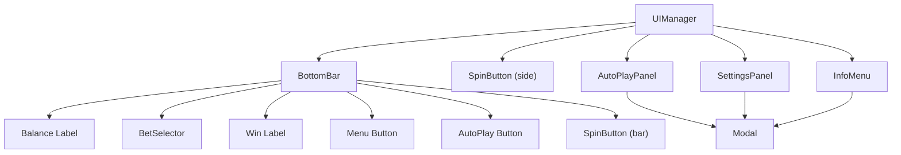

# UI System

The SDK provides a complete set of UI components managed by `UIManager`. All UI elements are rendered in PixiJS and automatically respond to layout changes (resize, orientation).

## Architecture Overview

`UIManager` owns all UI components and implements the `LayoutTarget` interface so the `ResponsiveManager` can reposition elements on every resize.



---

## BottomBar

The bottom bar is the primary game HUD, showing balance, bet, and win amounts along with navigation buttons.

### Sections

| Section | Position | Description |
|---|---|---|
| Menu button | Far left | Opens the Info Menu |
| Balance | Left | Current player balance, formatted with currency |
| Bet | Center-left | Bet selector with +/- buttons and tap-to-open panel |
| Win | Right | Last win amount (hidden when zero), gold color |
| AutoPlay button | Right of win | Opens the Auto Play panel |
| Spin button | Far right | Small spin button (hidden in landscape when side button is visible) |

### API

```ts
bottomBar.updateBalance(amount: number, currency: string): void;
bottomBar.updateWin(amount: number, currency: string): void;
bottomBar.updateBet(amount: number, currency: string): void;
bottomBar.setBetLevels(levels: number[], currency: string): void;
bottomBar.setSpinState(state: SpinButtonState): void;
bottomBar.setInteractive(enabled: boolean): void;
bottomBar.setSafeMargins(left: number, right: number): void;
bottomBar.layoutMode(mode: LayoutMode, width: number, height: number): void;
```

---

## SpinButton

A circular button with multiple visual states. The SDK creates two spin buttons: a small one in the bottom bar and a larger "side" button positioned next to the reels.

### States

| State | Color | Icon | Behavior on click |
|---|---|---|---|
| `idle` | Green (`0x22aa44`) | Play triangle | Emits `ui:spinButtonPressed` |
| `spinning` | Red (`0xcc3333`) | Stop square | Emits `ui:stopButtonPressed` |
| `stopping` | Red | Stop square | No action (waiting for reels) |
| `autoplay` | Orange (`0xcc8800`) | "AUTO" text | Emits `ui:autoPlayStopped` |
| `disabled` | Gray (`0x333333`) | None | No interaction, 50% opacity |

### Keyboard Support

The side spin button listens for `Space` key by default:
- **Space down** (no repeat): triggers spin/stop action
- **Space held** (300ms+): activates turbo spin mode while held
- **Space up**: deactivates turbo if it was activated by hold

### Hold-to-Turbo

Holding the spin button (pointer or keyboard) for 300ms+ enables turbo spin mode. Turbo is disabled when the button is released. This emits `ui:turboSpinToggled` events.

### Visual Feedback

- **Hover**: slight alpha reduction on the background
- **Press**: scale down to 93%
- **Release**: scale back to 100%
- Outer glow ring, inner highlight, and top gloss provide depth

---

## BetSelector

Inline bet selector embedded in the bottom bar.

### Components

- **Decrease button** (`-`): circular, steps down one bet level
- **Bet display**: shows current bet formatted with currency
- **Increase button** (`+`): circular, steps up one bet level
- **Tap area**: tapping the bet amount opens a full dropdown panel

### Dropdown Panel

When the bet display is tapped, a panel appears above showing all available bet levels as buttons. Selecting a level emits `bet:changed` and closes the panel.

### Events

| Event | Payload | Trigger |
|---|---|---|
| `bet:changed` | `{ bet: number }` | Bet level changed |

---

## AutoPlayPanel

A modal dialog for configuring and starting auto play.

### Layout

- **Spin count presets**: grid of buttons (3 columns) showing preset values (e.g. 10, 25, 50, 100, 250, 500)
- **Stop on Feature toggle**: `ToggleSwitch` to stop auto play when a bonus feature triggers

### Events

| Event | Payload | Trigger |
|---|---|---|
| `ui:autoPlayStarted` | `{ spins: number, stopOnFeature: boolean }` | Preset button clicked |
| `ui:autoPlayStopped` | (none) | Auto play cancelled |

---

## SettingsPanel

A modal dialog with game settings toggles.

### Toggles

| Setting | Default | Event |
|---|---|---|
| Sound | On | `ui:soundToggled` `{ enabled: boolean }` |
| Quick Spin | Off | `ui:quickSpinToggled` `{ enabled: boolean }` |
| Turbo Spin | Off | `ui:turboSpinToggled` `{ enabled: boolean }` |

---

## InfoMenu

A paginated modal that displays game rules, paytable, and feature descriptions.

### Features

- Supports `'text'` pages (word-wrapped content) and `'image'` pages (texture displayed as sprite)
- Navigation with Prev/Next buttons and page indicator ("1 / 5")
- Title updates per page
- Content defined in `GameConfig.ui.infoPages`

### Page Types

```ts
// Text page
{ title: 'Game Rules', type: 'text', content: 'Rules text here...' }

// Image page (texture alias from assetBundles)
{ title: 'Paytable', type: 'image', content: 'paytable_image' }
```

---

## Preloader

An HTML-based overlay (not PixiJS) that displays while assets load.

### Features

- Animated brand text with staggered letter pop-in
- Optional tagline with fade-in
- Thin progress bar with percentage text
- Minimum display time (prevents flash on fast connections)
- Smooth fade-out when `finish()` is called

### Lifecycle

1. Created during `GameApp.boot()` before asset loading begins
2. Progress updated as bundles load (0-30% for preload, 30-90% for game, 95% at init)
3. Game calls `game.hidePreloader()` after decorative elements are set up
4. Preloader waits for `minDisplayTime`, then fades out over 500ms and removes itself

### Configuration

Set via `GameConfig.preloader` or `RuntimeConfig.preloader`:

```ts
preloader: {
  brandText: 'LAB9191',
  tagline: 'G A M E S',
  bgColor: '#0a0a14',
  brandColor: '#ffffff',
  accentColor: '#22cc66',
  minDisplayTime: 2500,
}
```

---

## Base Components

### Button

Configurable rectangular button with rounded corners.

```ts
import { Button } from '@lab9191/slot-core';

const btn = new Button({
  width: 100,
  height: 50,
  label: 'SPIN',
  fontSize: 18,
  bgColor: 0x2a2a4a,
  bgColorHover: 0x3a3a5a,   // optional hover color
  cornerRadius: 8,
  borderWidth: 0,
});
btn.onClick(() => console.log('clicked'));
btn.enabled = false; // disable
```

### Label

Styled text element with alignment support.

```ts
import { Label } from '@lab9191/slot-core';

const label = new Label({
  text: 'BALANCE',
  fontSize: 11,
  color: 0x888888,
  fontWeight: 'bold',
  align: 'center',
});
```

### Modal

Base class for overlay panels (AutoPlayPanel, SettingsPanel, InfoMenu all extend it).

```ts
import { Modal } from '@lab9191/slot-core';

const modal = new Modal({
  width: 400,
  height: 350,
  title: 'MY PANEL',
  closeButton: true,
  bgColor: 0x1a1a2e,
  bgAlpha: 0.95,
  overlayAlpha: 0.7,
  cornerRadius: 16,
});

modal.open();   // show with fade
modal.close();  // hide
modal.onClose(() => console.log('closed'));
modal.contentContainer; // Container for adding custom content
```

Features:
- Full-screen dark overlay (click to dismiss)
- Centered panel with rounded corners and border
- Optional title and close button
- `resizeOverlay(width, height)` to adapt to viewport changes

### ToggleSwitch

On/off toggle with label text.

```ts
import { ToggleSwitch } from '@lab9191/slot-core';

const toggle = new ToggleSwitch({
  label: 'Quick Spin',
  defaultValue: false,
  fontSize: 18,
});
toggle.onChange((enabled) => console.log('toggled:', enabled));
toggle.value; // current boolean state
```

---

## Layout Diagrams

### Landscape (Desktop) Layout

```mermaid
graph TB
    subgraph Screen["Screen (1920 x 1080)"]
        subgraph GameLayer["Game Layer"]
            BG["Background (cover)"]
            Character["Character Sprite"]
        end
        subgraph ReelLayer["Reel Layer"]
            ReelBG["Reel Background"]
            Reels["5x3 Reel Grid<br/>(480,165 - 1480,755)"]
        end
        subgraph FXLayer["FX Layer"]
            Frame["Reel Frame"]
        end
        subgraph UILayer["UI Layer"]
            Title["Game Title<br/>(centered above reels)"]
            SideSpin["Side Spin Button<br/>(right of reels, r=65)"]
            Bar["Bottom Bar<br/>(y=1010, h=70)"]
        end
    end

    style Screen fill:#0a0a14
    style Bar fill:#0d0d1a
```



```
+------------------------------------------------------------------+
|                        GAME TITLE                                 |
|                                                                   |
|   [Character]  +------REEL FRAME------+     [Side Spin]          |
|                | sym  sym  sym  sym sym|     (  >  )              |
|                | sym  sym  sym  sym sym|                          |
|                | sym  sym  sym  sym sym|                          |
|                +-----------------------+                          |
|                                                                   |
+------------------------------------------------------------------+
| [=] BALANCE $1,000.00 | BET [-$1.00+] |   WIN $50.00  [A] ( > ) |
+------------------------------------------------------------------+
```

### Portrait (Mobile) Layout

```mermaid
graph TB
    subgraph Screen["Screen (1080 x 1920)"]
        subgraph Top["Top Area"]
            Title2["Game Title<br/>(centered, scaled down)"]
        end
        subgraph ReelArea["Reel Area"]
            Reels2["5x3 Reel Grid<br/>(25,240 - 1055,940)"]
        end
        subgraph Controls["Controls Area"]
            CenterSpin["Spin Button<br/>(centered, scale 1.3x)"]
        end
        subgraph BarArea["Bottom Bar"]
            Bar2["Bottom Bar<br/>(compact layout)"]
        end
    end

    style Screen fill:#0a0a14
    style BarArea fill:#0d0d1a
```



```
+------------------------------+
|         GAME TITLE           |
|                              |
|  +------------------------+  |
|  | sym  sym  sym  sym  sym|  |
|  | sym  sym  sym  sym  sym|  |
|  | sym  sym  sym  sym  sym|  |
|  +------------------------+  |
|                              |
|           (  >  )            |
|        Spin Button           |
|                              |
+------------------------------+
|[=] BAL $1k | BET $1 | WIN[A]|
+------------------------------+
```

In portrait mode:
- The side spin button moves to center below the reels and scales up to 1.3x for touch
- The character sprite is hidden
- The title scales down to 50% of screen width
- The bottom bar uses a compact 3-column layout
